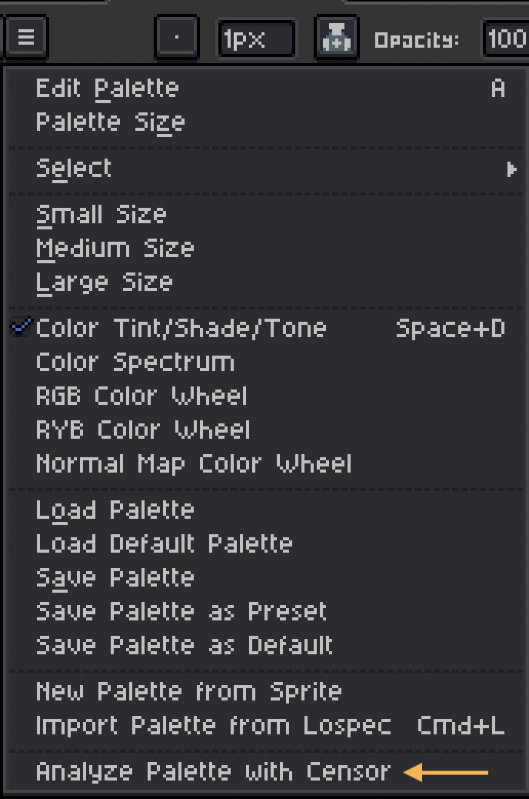

# Censor Color Palette Analyzer for Aseprite

*current release: [v0.1.0](https://sudo-whoami.itch.io/censor-analyzer-for-aseprite)*

This [Aseprite](https://aseprite.org) extension allows you to perform color palette analysis using Quickmarble's [Censor](https://github.com/Quickmarble/censor) palette analyzer directly within Aseprite.

## Latest Changes
Initial release!

## Requirements
This extension has been tested on Mac OS (specifically Mac OS Sequoia 15.4.1)

It is intended to run on Aseprite version 1.3.7 or later and requires API version 28 (as long as you have the latest version of Aseprite, you should be fine!)

## Permissions
When you run this plugin for the first time, you'll be aked to grant some permissions.

When prompted, select the "Give full trust to this script" checkbox and then click "Give Script Full Access" (you'll only need to do this once).

</img>

## Features & Usage
To use this plugin, just open the "Options" (≡) menu above the color palette and then select "Analyze palette with Censor"

</img>

When the analysis is complete, the plot will automatically open in Aseprite (as "analysis.png")

</img>

If you haven't installed the Censor tool, you'll get a warning dialog

</img>

## Installation
You can download this extension from [itch.io](https://sudo-whoami.itch.io/censor-analyzer-for-aseprite) as a "pay what you want" tool

## Dependencies

This extension relies on two key dependencies:

1. First you'll need to install [rustup](https://rustup.rs) so you can install Quickmarble's Censor tool.

> [!NOTE]
> You only need rustup so you can use Rust's package manager "Cargo" to install Censor - you don't need to know any Rust in order to use this tool!

> [!TIP]
> You can skip this step if you already have the Rust programming language toolchain installed

2. Once you've installed rustup, you can install the [Censor](https://github.com/Quickmarble/censor/tree/master?tab=readme-ov-file#installation) palette analyzer.

> [!TIP]
> You can run this command to install Censor
>
> `cargo install censor-analyser`

**TODO:** The plan for future versions of this extension is to bundle the Censor tool so you don't have to worry about installing it yourself!

## Thank you!

Huge thanks to Quickmarble for creating the amazing Censor tool

If you find this extension useful, please consider donating via itch.io to support further development! &hearts;
